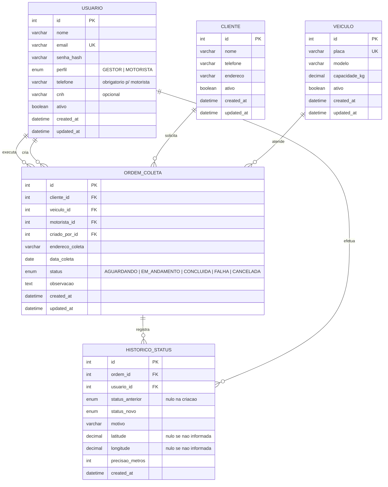
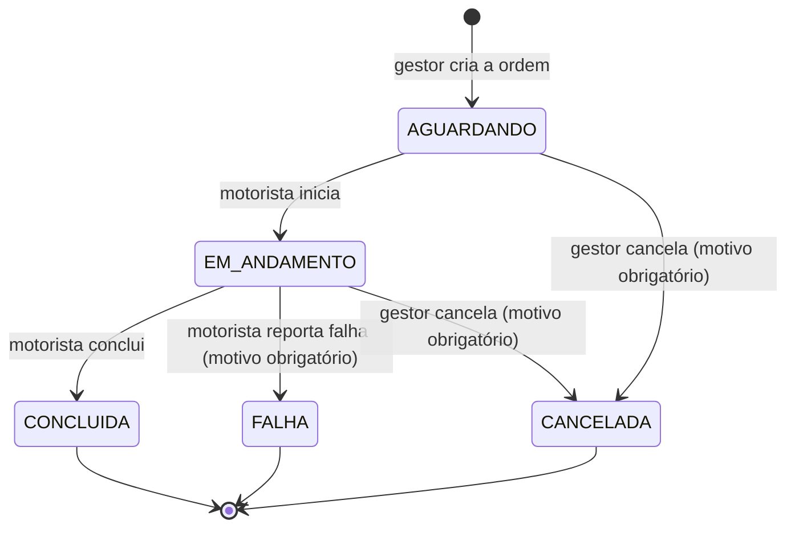

# Modelo de Dados (DER) — SIGCF

## Decisões de modelagem

**Tabela única de usuários (herança de tabela única).** Gestor e motorista diferem apenas em `telefone` e `cnh`, e todo motorista precisa autenticar para consultar suas coletas (RF03). Uma tabela `usuario` com a coluna `perfil` evita duplicação e junções desnecessárias. A obrigatoriedade do telefone para motoristas é validada na camada de serviço.

**Cliente como entidade.** Permite consultar o histórico de coletas por cliente — um dos problemas centrais levantados (perda de histórico) — e evita que o gestor redigite dados a cada ordem.

**`endereco_coleta` na ordem (snapshot).** O endereço é copiado do cliente no momento da criação e pode ser ajustado. Se o cliente mudar de endereço, as ordens antigas continuam registrando onde a coleta de fato ocorreu.

**`historico_status` (trilha de auditoria).** Cada mudança de status grava quem alterou, quando, de qual status para qual e o motivo (obrigatório em falha e cancelamento). É o que sustenta a rastreabilidade prometida ao gestor.

**Localização nas ações do motorista.** Quando o motorista inicia, conclui ou reporta falha em uma coleta, o registro de histórico guarda a latitude, a longitude e a precisão informada pelo GPS do celular. Não há rastreamento contínuo: a posição é capturada apenas nesses eventos e somente para ações do motorista, pelo princípio da necessidade da LGPD. Se a permissão for negada ou o GPS não responder, a ação é registrada sem coordenadas. As colunas usam `DECIMAL(9,6)`, precisão de cerca de 11 cm, suficiente para identificar o local do atendimento.

**Índice composto `(motorista_id, data_coleta)`.** A consulta mais frequente do sistema é "coletas do motorista X no dia Y" (RF03). O índice mantém essa consulta dentro do requisito de 300 ms conforme o volume cresce.

**Exclusão lógica.** Veículos, clientes e usuários são desativados (`ativo = false`) em vez de removidos, preservando a integridade referencial das ordens já registradas.

## Máquina de estados da ordem (RF04)

| Transição | Quem pode |
|---|---|
| AGUARDANDO → EM_ANDAMENTO | Motorista responsável pela ordem |
| EM_ANDAMENTO → CONCLUIDA | Motorista responsável pela ordem |
| EM_ANDAMENTO → FALHA | Motorista responsável pela ordem |
| AGUARDANDO/EM_ANDAMENTO → CANCELADA | Somente gestor |

`CONCLUIDA`, `FALHA` e `CANCELADA` são estados finais.
